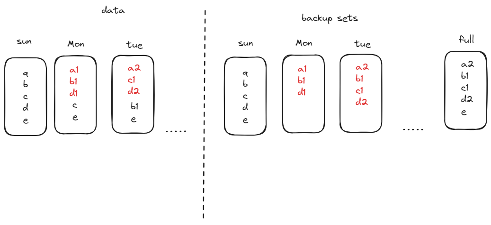

+++
title = '定时备份2'
date = 2024-04-26T20:36:58+08:00
ags = ['备份']
draft = false
+++

前面是最普通的定时备份方式，现在介绍一些更有趣的定时备份方式。

## 反向增量备份

为了解决最新一次增量备份恢复效率的问题，提出反向增量备份的概念。

反向增量备份最后一个备份副本始终是全量副本，而之前的备份副本是增量备份副本。

这样就可以快速恢复到最新时间点的数据，但是如果恢复历史数据就麻烦了一点。

## 永久增量备份

由于全量备份的耗时和占用问题，直接只做一次全量备份，后续都是增量备份的方式是永久增量备份。

永久的增量备份可以是前向也可以是反向。

## 合成备份

永久增量备份存在备份集过期的繁琐的问题，过期时需要确认所有增量备份集的关系。

合成备份就是直接使用备份介质中的全量和增量备份副本，合并成一个新的全量备份副本。

后续的增量备份直接在合成的全量备份副本基础上实现，并且已经合成的数据可以直接物理过期。

由于合成是在历史增量备份副本上实现的，有些厂商提供了先做一次增量备份再合成的选择。

## 总计

这些备份方式需要在备份策略中配合使用。

我设计的系统可以实现结合使用上述各种备份方式，并且恢复时更方便，每次备份都可以直接恢复全量数量。
